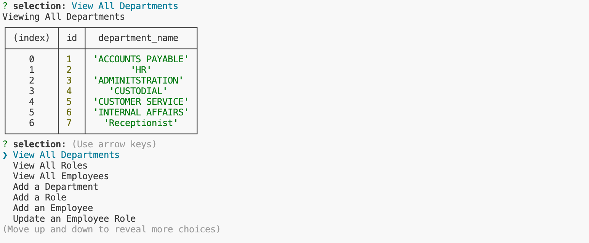

# employee-database-manager

## Description
This terminal application was created to quickly and efficiently manage an employe database.  Using simple commands, employees, departments, and roles can be created and updated.  This project gave me a basic understanding of how to use MYSQL, workbench, and the building blocks to creating databases in the future.  Check out the video walkthrough below to see this app in action.

[Video Walkthrough](https://watch.screencastify.com/v/SL3HdZsO2TWB5DaZKzG6)

## Table of Contents

1. [Installation](#installation)
2. [Usage](#usage)
3. [Credits](#credits)
4. [How to Contribute](#how-to-contribute)
5. [Tests](#tests)
6. [Questions](#questions)

## Installation
Clone the [employee-database-manager](https://github.com/crissyg923/employee-database-manager) and run npm i on your computer to install the dependencies.  To run the actual program, use the command "node init.js".

## Usage
This application can be used by running the command node init.js.  It is a basic database that is updated via user input.  

## Credits
This application was created utilizing the help of class assignment code, Rutgers TAs, and tutors.

## How to Contribute
Please contribute to this project by finding ways to make it more efficient, adding useful features, and developing a front end with a polished UI for easier, broad access.

## Tests
N/A

## License
MIT License
        Copyright (C) 2023 Crystal Green
        Permission is hereby granted, free of charge, to any person obtaining a copy
of this software and associated documentation files (the "Software"), to deal
in the Software without restriction, including without limitation the rights
to use, copy, modify, merge, publish, distribute, sublicense, and/or sell
copies of the Software, and to permit persons to whom the Software is
furnished to do so, subject to the following conditions:

The above copyright notice and this permission notice shall be included in all
copies or substantial portions of the Software.

THE SOFTWARE IS PROVIDED "AS IS", WITHOUT WARRANTY OF ANY KIND, EXPRESS OR
IMPLIED, INCLUDING BUT NOT LIMITED TO THE WARRANTIES OF MERCHANTABILITY,
FITNESS FOR A PARTICULAR PURPOSE AND NONINFRINGEMENT. IN NO EVENT SHALL THE
AUTHORS OR COPYRIGHT HOLDERS BE LIABLE FOR ANY CLAIM, DAMAGES OR OTHER
LIABILITY, WHETHER IN AN ACTION OF CONTRACT, TORT OR OTHERWISE, ARISING FROM,
OUT OF OR IN CONNECTION WITH THE SOFTWARE OR THE USE OR OTHER DEALINGS IN THE
SOFTWARE. 

## Questions
Crystal Green

(862) 205-9019

crissybrown1992@icloud.com

[Github](https://github.com/crissyg923)